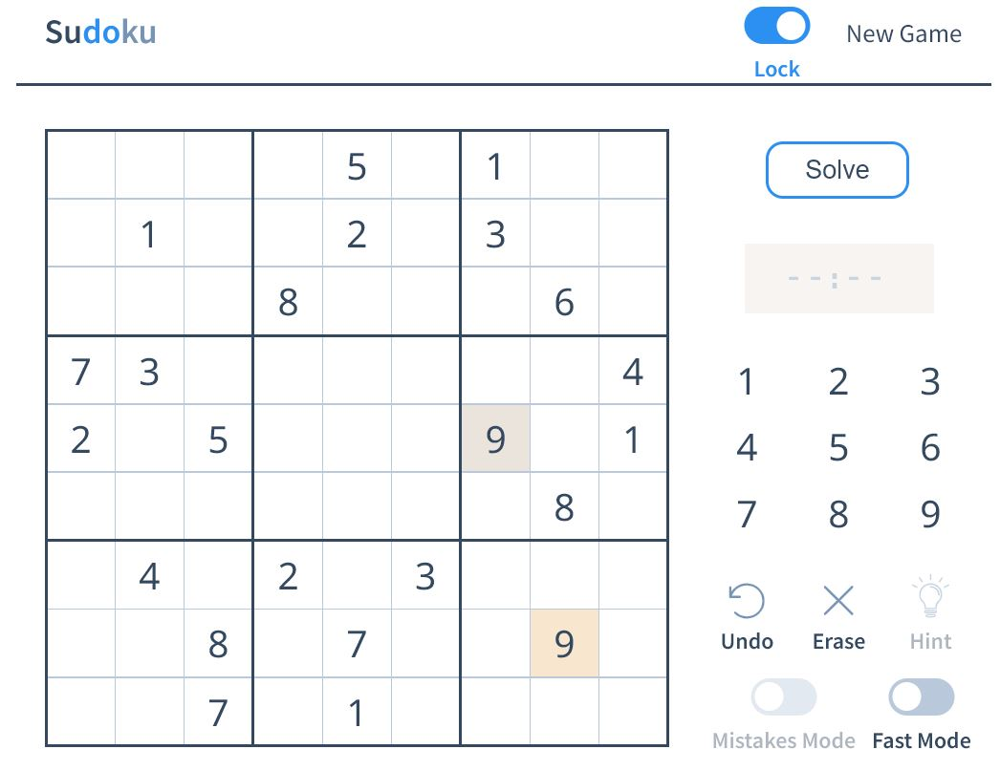
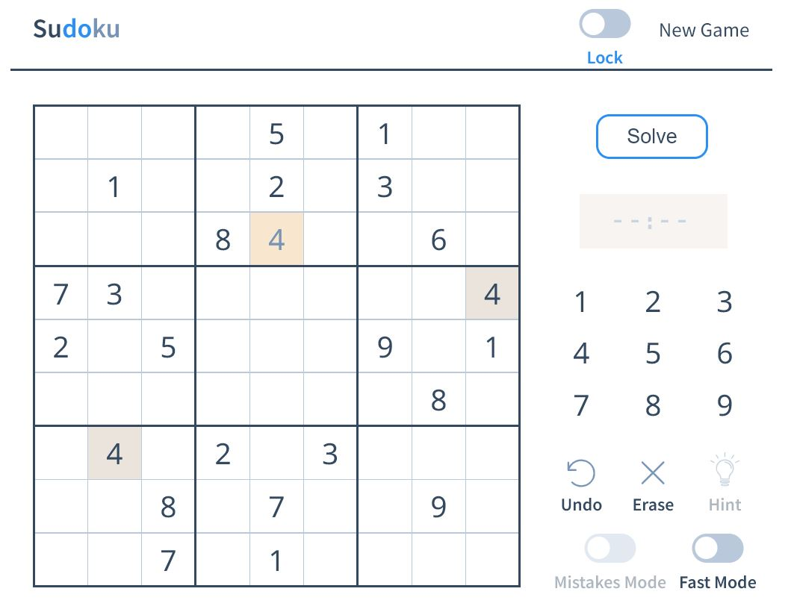
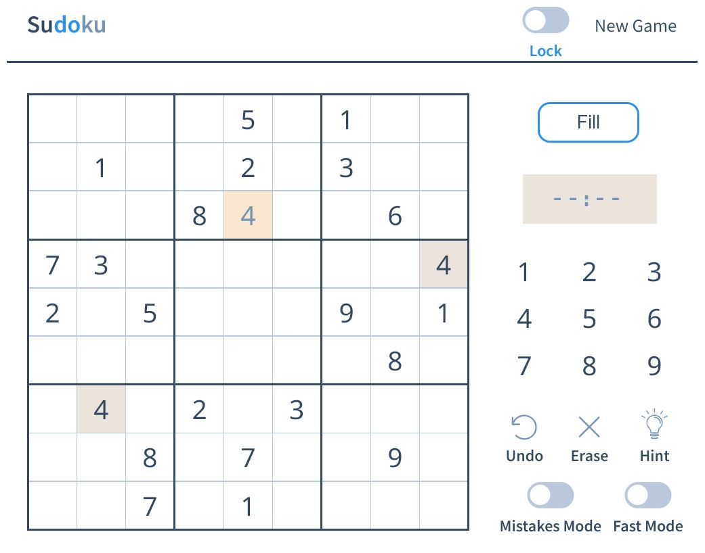
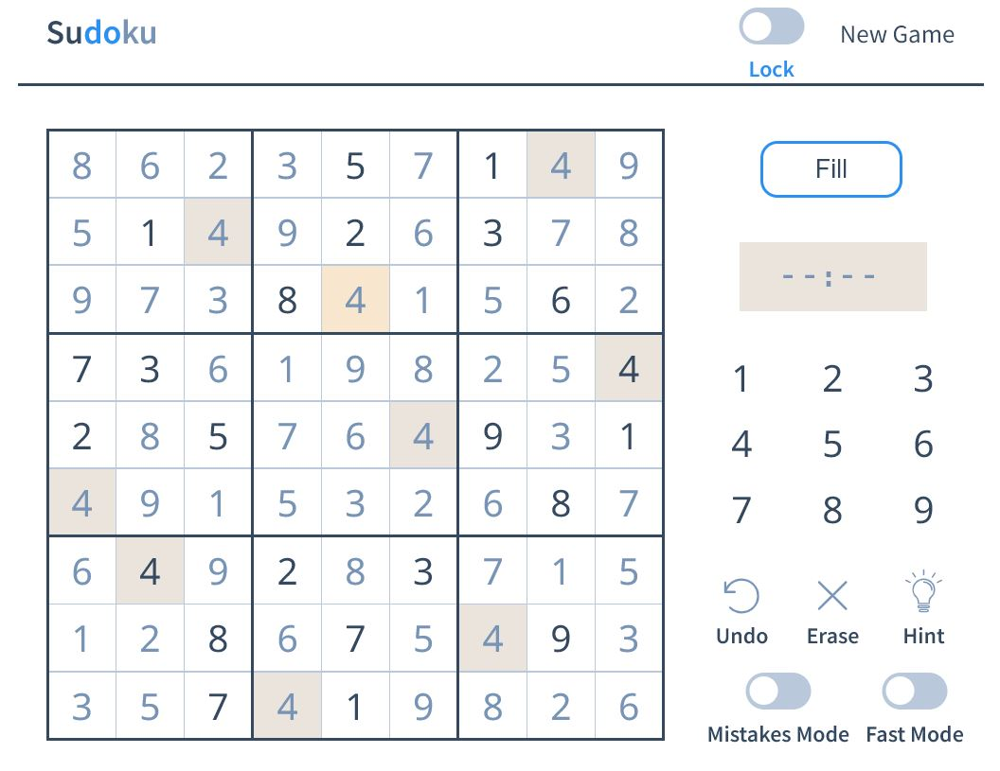

# sudoku

A Sudoku game in React!

The application can be accessed here; [https://anushalihala.github.io/sudoku/](https://anushalihala.github.io/sudoku/)

## Core ReactJS 

Core ReactJS code courtesy of [https://github.com/raravi](https://github.com/raravi)

### React Features

This project aims to highlight the use of React to build a game and also maintaining state in one place. By having a 'Single Source of Truth', it becomes easier to keep updating the different parts of the UI based on state changes!

A fun way to learn React for those who are still in the beginning stages!

Features:

* Only functional components!
* useEffect, useState hooks instead of state.
* Simple use of `props`.
* All the game logic resides in a single component.
* Use CSS Custom properties to keep the stylesheet DRY.
* Understand how functions can be sent down as `props` and consumed.
* Typescript for static type checking!

## Sudoku Solver

Sudoku Solver code courtesy of [https://github.com/JackHeTech](https://github.com/JackHeTech) and is located at `./src/solver/sudokuSolver.js`.

The link to the original repository can be found her [https://github.com/JackHeTech/Sudoku-Solver](https://github.com/JackHeTech/Sudoku-Solver).

## Feature Modifications

The main change is in the purpose of the application. The original application generated and displayed Sudokus of varying difficulties for users to solve. The modified application lets users enter their own Sudokus which the application assists them in solving by providing hints and complete solutions. \
To this effect, 2 new features have been designed and implemented; Lock and Solve.

### Lock

Switching ON Lock mode allows users to enter the predetermined Sudoku numbers. \
These appear in black coloured font.

Once the predetermined numbers have been filled, Lock mode can be switched OFF. Any numbers entered in this mode appear in a grey colour as shown by the highlighted '4' in the image below.

### Solve

The Solve button can be clicked to compute a solution for the Sudoku. \
Once the Solve button is clicked, the 'Hint' button and 'Mistakes Mode' are enabled. \
The Solve button also changes to a 'Fill' button.

On clicking Fill, the found solution is used to populate the cells of the Sudoku.

